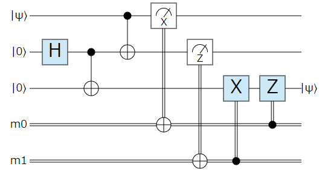

# gitbook-plugin-quantumcircuit
Honkit plugin for visualizing quantum circuit.
Converting ` ... ` tags to the SVG image of quantum circuits using [two.js](https://two.js.org/), or to the WebGL canvas using [pixi.js](https://pixijs.com/). Since the number of WebGL canvas is limited, this plugin shows image with two.js by default.

## Install

`package.json`:

```json
{
    "devDependencies": {
        "gitbook-plugin-quantumcircuit": "git+https://github.com/kodack64/gitbook-plugin-quantumcircuit",
    }
}
```

`book.json`:

```json
{
	"plugins": [
		"quantumcircuit"
	]
}
```

then run `npm update` and `npx honkit serve`.

## Example

By inserting json-like object among the markdown, the SVG images will be automatically inserted.

```

{
    qubit_name: {0: "|ψ⟩", 1: "|0⟩", 2: "|0⟩", },
    register_name: {0: "m0", 1: "m1",},
    output_name: {2: "|ψ⟩",},
    operations: [
        {name: "H", step: 0, target: [1], }, 
        {name: "X", step: 1, target: [2], control: [1], }, 
        {name: "X", step: 2, target: [1], control: [0], }, 
        {name: "X", step: 3, target: [0], measurement: true, outcome: [0],}, 
        {name: "Z", step: 4, target: [1], measurement: true, outcome: [1],}, 
        {name: "X", step: 5, target: [2], condition: [1], }, 
        {name: "Z", step: 6, target: [2], condition: [0], }, 
    ]
}

```

The above will be converted as:




## Format

- `num_qubit (int)`: (optional) The number of qubit. If not assigned, determined from the maximum index of operations.
- `num_register (int)`: (optional) The number of register. If not assigned, determined from the maximum index of operations.
- `qubit_name (dict[int, str])`: (default to `{}`) The map from qubit indices to the name of them. The name is shown in the left of corresponding wire. If key not found, no text is shown.
- `register_name (dict[int, str])`: (default to `{}`) The map from register indices to the name of them. The name is shown in the left of corresponding wire. If key not found, no text is shown.
- `output_name (dict[int, str])`: (default to `{}`) The map from output-wire indices to the name of them. The name is shown in the right of corresponding wire. If key not found, no text is shown.
- `operations (list)`: (required) The list `operations` must be a list of the following `dict` objects.
  - `name (str)`: (required) The name of gate. The texts are shown in the box of gates. Several strings are registered as special strings.
  - `step (int)`: (required) The index of moment of a quantum gate.
  - `color_fill (str)`: (default to `"#cde9f7"`)  The filling color of gate box. Specified with "#rrggbb", where "#000000" is black and "#ffffff" is white.
  - `color_fill (str)`: (default to `"#cde9f7"`)  The stroke colof of gate box. Specified with "#rrggbb", where "#000000" is black and "#ffffff" is white.
  - `target (list[int])`: (default to `[]`) The list of indices of target qubits.
  - `control (list[int])`: (default to `[]`) The list of indices of control qubits, shown as black circle.
  - `control_neg (list[int])`: (default to `[]`) The list of indices of not-control qubits, shown as white circle.
  - `condition (list[int])`: (default to `[]`) The list of indices of conditioning classical registers.
  - `outcome (list[int])`: (default to `[]`) The list of indices of registers where the measurement gate writes.
  - `measurement (bool)`: (deafult to `false`) If true, the block becomes measurement mark.
  - `classical (bool)`: (deafult to `false`) If true, the gate acts on the classical register instead of qubit wires.

### Special gate name

The following names are considered as special key, and when conditions are satisfied, special marks are used.

- `X`: If the number of items in `control` and `control_neg` is no less than 1, a popular CNOT-block is used.
- `Z`: If the number of items in `control` is one and `control_neg` is zero, then, a popular Control-Z block is used.
- `SWAP`: If the number of items in `target` is two and has no `control` and `control_neg`, then wires are physical swapped.
- `WIRE`: If the number of items in `target` is two and has no `control` and `control_neg`, the wire of the first item in `target` is connected to the wire of the second item. 

If you want to use quantum gates with these characters, add whitespace before or after the name. These blanks are trimmed when it is used.

### Demo

```

{
    num_qubit: 5,
    num_register: 3,
    qubit_name: { 0: "q0", 2: "a0", },
    register_name: { 1: "ans",},
    output_name: { 0: "out",},
    operations: [
        // simultaneous gate
        {name: "X", step: 0, target: [0]}, 
        {name: "U3", step: 0, target: [1]}, 

        // large gate box
        {name: "RZZZ", step: 1, target: [1, 2, 3]}, 
        {name: "RZZ", step: 2, target: [1, 3]}, 

        // multiple controls
        {name: "X", step: 3, target: [1, 3], control: [2], control_neg: [0],}, 
        {name: "Z", step: 4, target: [2], control: [3],}, 

        // complex wiring
        {name: "SWAP", step: 4, target: [0, 1],}, 
        {name: "WIRE", step: 5, target: [1, 0],}, 
        {name: "WIRE", step: 5, target: [2, 3],}, 
        {name: "WIRE", step: 5, target: [0, 2],}, 
        {name: "WIRE", step: 5, target: [3, 1],}, 

        // measurement and feedback
        {name: "X", step: 6, target: [1], outcome: [1], measurement: true,}, 
        {name: "X", step: 7, target: [2], outcome: [2], measurement: true,}, 
        {name: "V(Θ)", step: 8, target: [0, 2], condition: [1],}, 
        {name: "X", step: 9, target: [1], classical: true,}, 
    ]
}

```

The above will be converted as:


